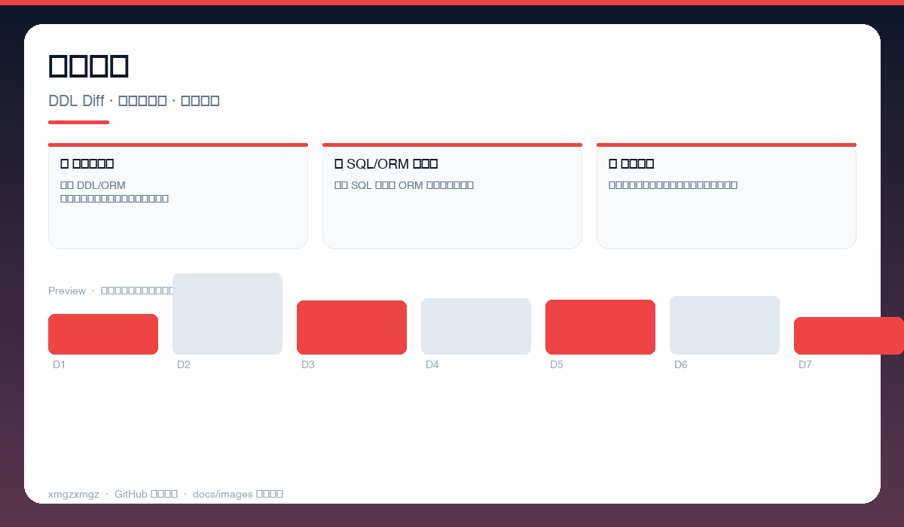
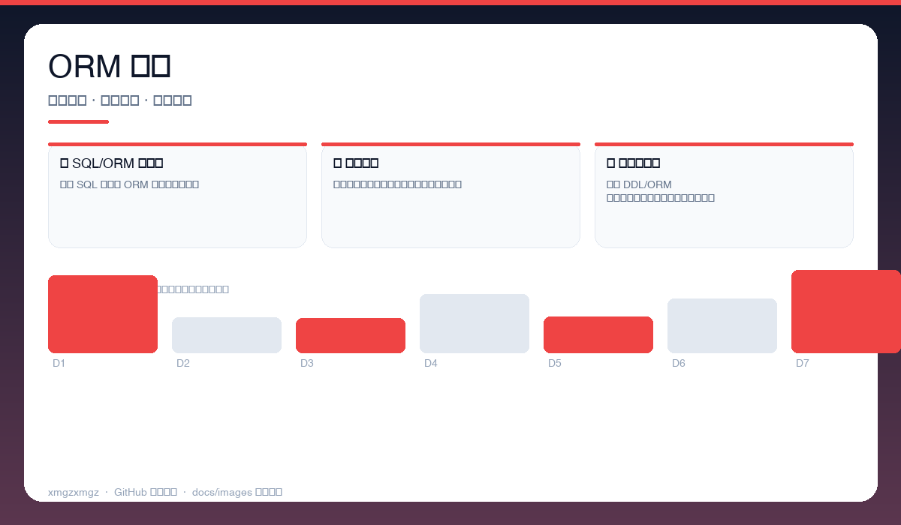
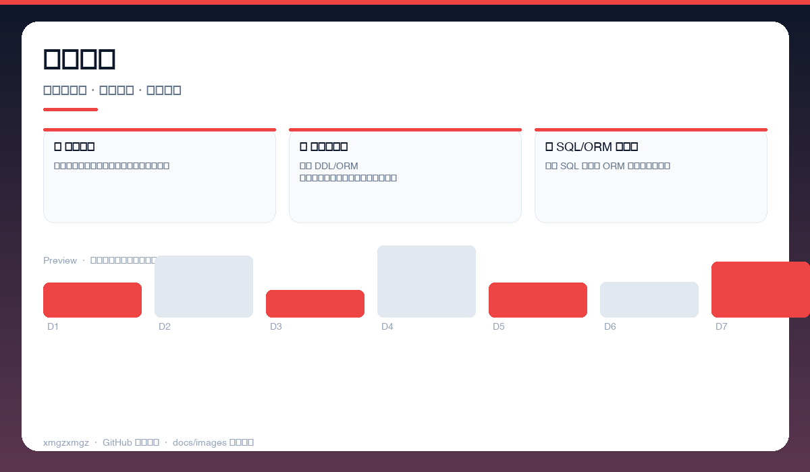

# 🔍 SchemaLinter — SchemaLinter

> 改表不再心惊胆战 — 变更影响面一键分析，防线上事故于未然。

[](https://github.com/xmgzxmgz/SchemaLinter)
[](https://github.com/xmgzxmgz/SchemaLinter/releases)
[](LICENSE)
[](https://github.com/xmgzxmgz/SchemaLinter/actions/workflows/release.yml)

---

## ✨ 功能一览

| 模块 | 能力 | 状态 |
|------|------|------|
| 🔎 影响面分析 | 解析 DDL/ORM 变更，定位受影响的表、索引与查询 | ✅ |
| 🧩 SQL/ORM 双支持 | 直连 SQL 与主流 ORM 模型，覆盖更全 | ✅ |
| 🚦 风险评级 | 按影响范围与线上流量给出风险等级与建议 | ✅ |

---

## 📸 功能预览

> 以下为自动生成的示意预览（无需本地部署截图），展示核心功能形态。

| 总览 | 细节 | 流程 |
|------|------|------|
|  |  |  |
| 变更对比 · DDL Diff · 影响表高亮 · 风险标注 | ORM 扫描 · 模型扫描 · 查询链路 · 索引影响 | 风险报告 · 影响面清单 · 风险等级 · 修复建议 |

<details>
<summary>查看大图</summary>


</details>

---

## 🚀 快速开始

```bash
pip install schemalinter
schemalinter diff --from schema.old.sql --to schema.new.sql
schemalinter check --orm models.py --migration 0012_alter_user.py
```

---

## 🛠 技术栈

Python · SQL Parsing · ORM Introspection · Diff Analysis

---

## 🗂️ 目录结构（节选）

```
SchemaLinter/
├── docs/images/        # 本 README 的三张自动生成预览图
├── .github/workflows/  # Auto Release 自动发版
├── README.md
└── ...                 # 源码与配置
```

---

## 📦 Releases

本仓库已启用 **Auto Release**（`.github/workflows/release.yml`）：

- 推送 `v*` tag 自动发版：`git tag v0.2.0 && git push origin v0.2.0`
- 手动触发：`gh workflow run "Auto Release" -f version=v0.2.0`（留空则自动 patch +1）
- 变更说明自动生成（`--generate-notes`）

前往 [Releases](https://github.com/xmgzxmgz/SchemaLinter/releases) 查看。

---

## 🙏 相关项目

- [workbuddy-account-hub](https://github.com/xmgzxmgz/workbuddy-account-hub) — WorkBuddy 账户中枢（本 README 的样板）
- 更多见 [xmgzxmgz 主页](https://github.com/xmgzxmgz)

---

## 许可

MIT
